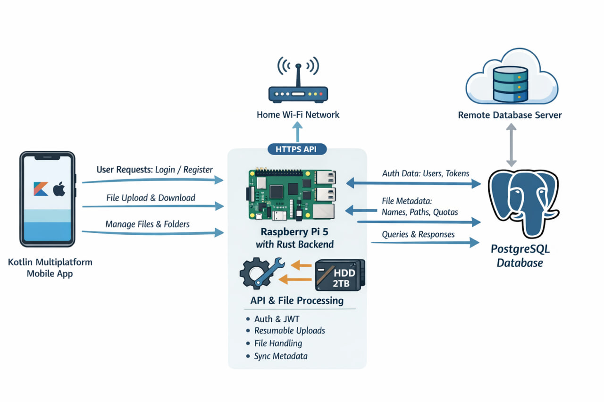

# spacebox

## Description
This project is backend api for cloud app. The backend API is divided into three independent modules with clear responsibilities:

#### 1. Authentication & Registration
**Base path:** `/api/v1`

- `POST /api/v1/register`  
  Registers a new user with mandatory email verification (code sent to email)

- `POST /api/v1/login`  
  Authenticates an existing user

### 2. Storage Service
**Base path:** `/api/v1/storage`

Responsible for:
- Uploading files
- Creating and managing personal user folders
- Basic file storage operations

### 3. File Tagging
**Base path:** `/api/v1/tags`

Purpose:
- Assign tags / topics / categories to user files
- Enable efficient search and filtering of files by tags

### Project schema
